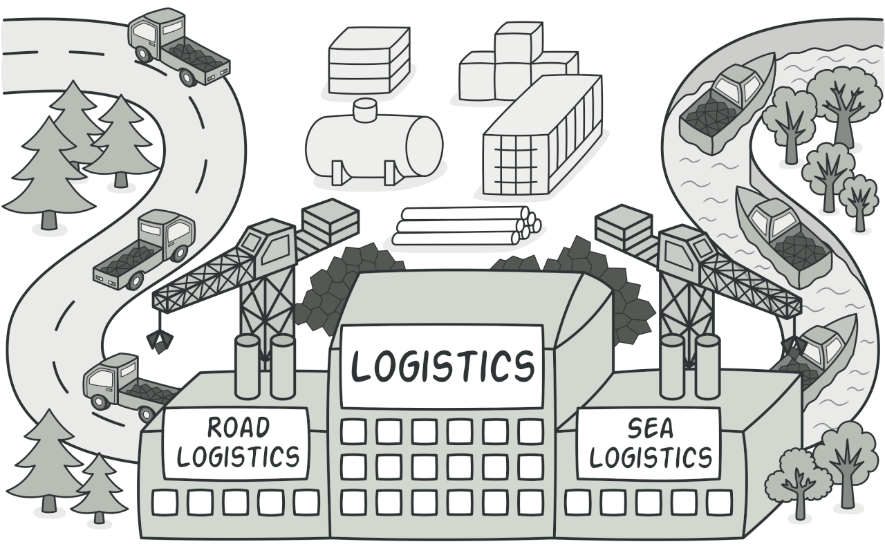
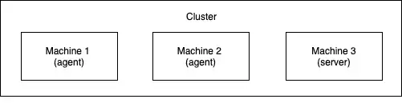
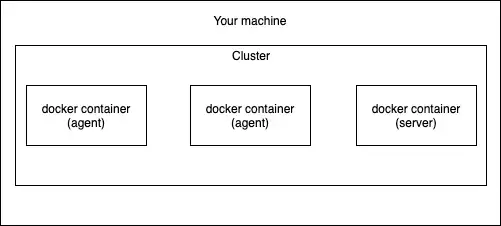
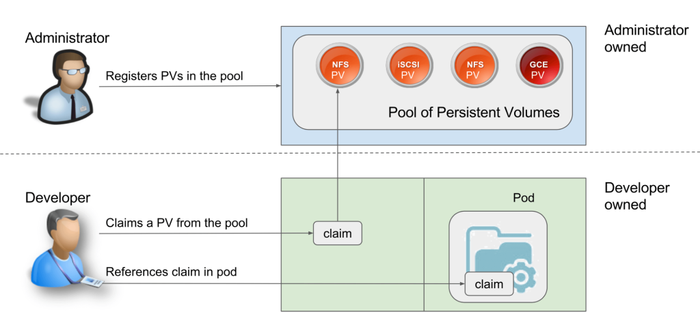

# Moriono

## Scrum


### Definition

- Is a lightweight framework that helps people, teams and organizations generate value through adaptive solutions for complex problems.
- Basically requires a Scrum Master to foster an environment where:
	+ A Product Owner orders the work for a complex problem into a Product Backlog
	+ The Scrum Team turns a selection of the work into an Increment of value during a Sprint
	+ The Scrum Team and its stakeholders inspect the results and adjust for the next Sprint
	+ Repeat

### The Scrum Team

- Consists of:
	+ 1 Scrum Master
	+ 1 Product Owner
	+ Developers
- No sub-teams
- No hierarchies
- Typically 10 or fewer people
- If Scrum Teams become too large, they should consider reorganizing into multiple cohesive Scrum Teams:
	+ Each focused on the same product
	+ They should share:
	  * The same Product Goal
		* Product Backlog
		* Product Owner
- Is responsible for all product-related activities:
	+ Stakeholder collaboration
  + Verification
  + Maintenance
  + Operation
  + Experimentation
  + Research and development
  + Anything else that might be required

#### Three accountabilities:

+ **The Developers:** are the people in the Scrum Team that are committed to creating any aspect of a usable Increment each Sprint
	* Creating a plan for the Sprint, the Sprint Backlog
	* Instilling quality by adhering to a Definition of Done
	* Adapting their plan each day toward the Sprint Goal
	* Holding each other accountable as professionals
+ **the Product Owner**
	* Is accountable for maximizing the value of the product resulting from the work of the Scrum Team
	* Is accountable for effective Product Backlog management
		- Developing and explicitly communicating the Product Goal
		- Creating and clearly communicating Product Backlog items
		- Ordering Product Backlog items
		- Ensuring that the Product Backlog is transparent, visible and understood
	* The Product Owner is one person, not a committee
		- May represent the needs of many stakeholders in the Product Backlog
		- Those wanting to change the Product Backlog can do so by trying to convince the Product Owner
 
+ **The Scrum Master**
	* Is accountable for establishing Scrum as defined in the Scrum Guide
	* Help everyone understand Scrum theory and practice
	* Is accountable for the Scrum Team’s effectiveness
	* Serves the Scrum Team in:
		- Coaching the team members in self-management and cross-functionality
		- Helping the Scrum Team focus on creating high-value Increments that meet the Definition of Done
		- Causing the removal of impediments to the Scrum Team’s progress
		- Ensuring that all Scrum events take place and are positive, productive, and kept within the timebox
	* Serves the Prduct Owner in:
		- Helping find techniques for effective Product Goal definition and Product Backlog management
		- Helping the Scrum Team understand the need for clear and concise Product Backlog items
		- Helping establish empirical product planning for a complex environment
		- Facilitating stakeholder collaboration as requested or needed

### Scrum Events

- The Sprint is a container for all other events
- Each event in Scrum is a formal opportunity to inspect and adapt Scrum artifacts
- These events are specifically designed to enable the transparency required
- Optimally, all events are held at the same time and place to reduce complexity

#### Sprint

- Fixed length events of one month or less
- A new Sprint starts immediately after the conclusion of the previous
- During a sprint
	+ No changes are made that would endanger the Sprint Goal
	+ Quality does not decrease
	+ The Product Backlog is refined as needed
	+ Scope may be clarified and renegotiated with the Product Owner as more is learned
- A Sprint could be cancelled if the Sprint Goal becomes obsolete
- Only the Product Owner has the authority to cancel the Sprint.
- What happens within a Sprint:

	##### Sprint Planning

	+ Initiates the Sprint by laying out the work to be performed for the Sprint
	+ Timeboxed to a maximum of eight hours for a one-month Sprint. For shorter Sprints, the event is usually shorter
	+ Addresses the following topics
		* Why is this Sprint valuable?
			- The whole Scrum Team then collaborates to define a Sprint Goal that communicates why the Sprint is valuable to stakeholders
			- The Sprint Goal must be finalized prior to the end of Sprint Planning
		* What can be Done this Sprint?
			- The Developers select items from the Product Backlog to include in the current Sprint
			- The Scrum Team may refine these items during this process
		* How will the chosen work get done?
			- For each selected Product Backlog item, the Developers plan the work necessary to create an Increment that meets the Definition of Done
			- Often done by decomposing Product Backlog items into smaller work items of one day or less (US)

	##### Daily Scrums

	+ Purpose:
		* Inspect progress toward the Sprint Goal
  	* Adapt the Sprint Backlog as necessary
  	* Adjust the upcoming planned work
	+ Is a 15-minute event for the Developers of the Scrum Team
	+ Held at the same time and place every working day of the Sprint
	+ If the Product Owner or Scrum Master are actively working on items in the Sprint Backlog, they participate as Developers
	+ Focuses on progress toward the Sprint Goal
	+ Produces an actionable plan for the next day of work
	+ The Daily Scrum is not the only time Developers are allowed to adjust their plan. They often meet throughout the day for more detailed discussions about adapting or re-planning the rest of the Sprint’s work

	##### Sprint Review

	+ Inspect the outcome of the Sprint and determine future adaptations
	+ The Scrum Team presents the results of their work to key stakeholders
	+ Progress toward the Product Goal is discussed
	+ The Scrum Team and stakeholders review what was accomplished in the Sprint and what has changed in their environment
		* Based on this information, attendees collaborate on what to do next
		* The Sprint Review is a working session and the Scrum Team should avoid limiting it to a presentation
	+ Is timeboxed to a maximum of four hours

	##### Sprint Retrospective

	+ The purpose is to plan ways to increase quality and effectiveness
	+ The Scrum Team inspects how the last Sprint went with regards to individuals, interactions, processes, tools, and their Definition of Done
	+ The Scrum Team discusses what went well during the Sprint, what problems it encountered, and how those problems were (or were not) solved
	+ Timeboxed to a maximum of three hours for a onemonth Sprint

### Scrum Artifacts

#### Product Backlog

+ Is an ordered list of what is needed to improve the product
+ It is the single source of work undertaken by the Scrum Team
+ Product Backlog items that can be Done by the Scrum Team within one Sprint are deemed ready for selection in a Sprint Planning event
+ Product Backlog refinement is the act of breaking down and further defining Product Backlog items into smaller more precise items
+ The Developers who will be doing the work are responsible for the sizing

#### Product Goal

+ Describes a future state of the product which can serve as a target for the Scrum Team to plan against
+ The Product Goal is in the Product Backlog
+ Is the long-term objective for the Scrum Team. They must fulfill (or abandon) one objective before taking on the next

#### Sprint Backlog

+ Is composed of
	* The Sprint Goal (why)
	* The set of Product Backlog items selected for the Sprint (what)
	* An actionable plan for delivering the Increment (how)
+ Is a plan by and for the Developers
+ Highly visible, real-time picture of the work that the Developers plan to accomplish during the Sprint in order to achieve the Sprint Goal
+ Is updated throughout the Sprint as more is learned

#### Sprint Goal

+ Is the single objective for the Sprint
+ Is created during the Sprint Planning event and then added to the Sprint Backlog
+ As the Developers work during the Sprint, they keep the Sprint Goal in mind
+ If the work turns out to be different than they expected, they collaborate with the Product Owner to negotiate the scope of the Sprint Backlog within the Sprint without affecting the Sprint Goal

#### Increment

+ Is a concrete stepping stone toward the Product Goal
+ Each Increment is additive to all prior Increments, ensuring that all Increments work together
+ In order to provide value, the Increment must be usable
+ Multiple Increments may be created within a Sprint
+ The sum of the Increments is presented at the Sprint Review thus supporting empiricism
+ An Increment may be delivered to stakeholders prior to the end of the Sprint
+ The Sprint Review should never be considered a gate to releasing value
+ Work cannot be considered part of an Increment unless it meets the Definition of Done

#### Definition of Done

+ Is a formal description of the state of the Increment when it meets the quality measures required for the product
+ The moment a Product Backlog item meets the Definition of Done, an Increment is born
+ If a Product Backlog item does not meet the Definition of Done, it cannot be released or even presented at the Sprint Review. Instead, it returns to the Product Backlog for future consideration
+ If the Definition of Done for an increment is part of the standards of the organization, all Scrum Teams must follow it as a minimum
+ If it is not an organizational standard, the Scrum Team must create a Definition of Done appropriate for the product
+ If there are multiple Scrum Teams working together on a product, they must mutually define and comply with the same Definition of Done

### Useful resources

[The Official Scrum Guide](https://scrumguides.org/scrum-guide.html)

### Certification

[Scrum Foundation Professional Certification - SFPC™](https://www.credly.com/badges/2be806e6-da64-46fb-9cf5-39f6cdefe6c2/linked_in_profile)

## SOLID

- Design principles that are a set of five guidelines to help software developers design flexible, maintainable, and scalable systems.

### 1. Single Responsibility Principle (SRP)

- A class should have only one reason to change, meaning it should only have one job or responsibility.
- Each class should focus on a single task. This makes the class easier to understand, test, and maintain.
- If a class has multiple responsibilities, changes in one responsibility may affect or break the other.

### 2. Open/Closed Principle (OCP)

- Software entities (classes, modules, functions, etc.) should be open for extension but closed for modification.
- You should be able to add new functionality to a class without changing its existing code.
- Achieved through abstraction and polymorphism, where new behavior can be added by creating new subclasses or modules.

### 3. Liskov Substitution Principle (LSP)

- Subtypes must be substitutable for their base types without altering the correctness of the program.
- Derived classes should extend the base classes without changing their behavior.
- Ensures that a subclass can stand in for its superclass without the program failing or producing incorrect results.

### 4. Interface Segregation Principle (ISP)

- Clients should not be forced to depend on interfaces they do not use.
- It's better to have many specific interfaces rather than a single, general-purpose interface.
- Encourages the creation of smaller, more focused interfaces, ensuring that classes only need to implement the methods they actually use.

### 5. Dependency Inversion Principle (DIP)

- High-level modules should not depend on low-level modules. Both should depend on abstractions. Abstractions should not depend on details. Details should depend on abstractions.
- Promotes the use of interfaces or abstract classes to reduce the dependency on concrete implementations.
- Helps in achieving a decoupled system, making it easier to change and maintain.

### Benefits

- **Maintainability**: Easier to update and modify code without introducing bugs.
- **Scalability**: Simplifies adding new features.
- **Testability**: Facilitates unit testing by isolating components.
- **Flexibility**: Makes it easier to refactor and improve code over time.
- **Readability**: Enhances code clarity and comprehension. 

## OOP

Is a programming paradigm that uses objects and classes to structure software in a way that is modular, reusable, and easy to maintain. The four main principles of OOP are:

1. **Encapsulation**
2. **Inheritance**
3. **Polymorphism**
4. **Abstraction**

### 1. Encapsulation

- Bundling data and methods in a class and restricting access through access modifiers.

**Example:**
```java
public class Person {
    // Private fields
    private String name;
    private int age;
    
    // Public getter for name
    public String getName() {
        return name;
    }
    
    // Public setter for name
    public void setName(String name) {
        this.name = name;
    }
    
    // Public getter for age
    public int getAge() {
        return age;
    }
    
    // Public setter for age
    public void setAge(int age) {
        if (age > 0) {
            this.age = age;
        }
    }
}
```
In this example, the `name` and `age` fields are encapsulated within the `Person` class. Access to these fields is provided through public getter and setter methods.

### 2. Inheritance

- One class inherits the properties and methods of another class.
- The class that inherits is called the subclass.
- The class from which it inherits is called the superclass.

**Example:**
```java
// Superclass
public class Animal {
    public void eat() {
        System.out.println("This animal eats food.");
    }
}

// Subclass
public class Dog extends Animal {
    public void bark() {
        System.out.println("The dog barks.");
    }
}

// Using inheritance
public class Main {
    public static void main(String[] args) {
        Dog dog = new Dog();
        dog.eat(); // Inherited method
        dog.bark(); // Subclass method
    }
}
```
In this example, `Dog` inherits from `Animal`, so it has access to the `eat` method defined in `Animal`.

### 3. Polymorphism

- Allows objects to be treated as instances of their parent class rather than their actual class.
- It enables one interface to be used for a general class of actions. The specific action is determined by the exact nature of the situation.
- 2 types:
	1. **Static Polymorphism (Compile-time Polymorphism)**:
		- Resolved at compile time
		- E.g.: method overloading (same name, different parameter lists)
	2. **Dynamic Polymorphism (Run-time Polymorphism)**:
		- Resolved at run time
		- E.g.: method overriding (subclass provides a specific implementation of a method that is already defined in its superclass)

**Example:**
```java
// Superclass
public class Animal {
    public void makeSound() {
        System.out.println("Some generic animal sound");
    }
}

// Subclass
public class Dog extends Animal {
    @Override
    public void makeSound() {
        System.out.println("Bark");
    }
}

// Subclass
public class Cat extends Animal {
    @Override
    public void makeSound() {
        System.out.println("Meow");
    }
}

// Using dynamic polymorphism
public class Main {
    public static void main(String[] args) {
        Animal myDog = new Dog();
        Animal myCat = new Cat();
        
        myDog.makeSound(); // Outputs "Bark"
        myCat.makeSound(); // Outputs "Meow"
    }
}
```
In this example, the `makeSound` method is overridden in both `Dog` and `Cat` subclasses, demonstrating polymorphism. The `Animal` reference can point to any subclass object, and the appropriate method is called based on the actual object.

### 4. Abstraction

- Hiding complex implementation details and exposing only the essential features.
- Is achieved using abstract classes and interfaces.

**Example with Abstract Class:**
```java
// Abstract class
public abstract class Shape {
    abstract void draw();
}

// Subclass
public class Circle extends Shape {
    @Override
    void draw() {
        System.out.println("Drawing a circle");
    }
}

// Subclass
public class Rectangle extends Shape {
    @Override
    void draw() {
        System.out.println("Drawing a rectangle");
    }
}

// Using abstraction
public class Main {
    public static void main(String[] args) {
        Shape circle = new Circle();
        Shape rectangle = new Rectangle();
        
        circle.draw(); // Outputs "Drawing a circle"
        rectangle.draw(); // Outputs "Drawing a rectangle"
    }
}
```
In this example, `Shape` is an abstract class with an abstract method `draw`. `Circle` and `Rectangle` provide the implementation for this method.

## Design patterns

- Are typical solutions to commonly occurring problems in software design
- Pre-made blueprints that you can customize to solve a recurring design problem in your code
- The pattern is not a specific piece of code, but a general concept for solving a particular problem

### Creational Design Patterns

- Provide various object creation mechanisms, which increase flexibility and reuse of existing code

#### Factory Method



- Provides an interface for creating objects in a superclass, but allows subclasses to alter the type of objects that will be created.
- The essence is to define an interface for creating an object, but let subclasses decide which class to instantiate.
- Pros:
	+ Avoid tight coupling between the creator and the concrete products.
	+ Single Responsibility Principle: You can move the product creation code into one place in the program, making the code easier to support.
	+ Open/Closed Principle. You can introduce new types of products into the program without breaking existing client code.
- Cons: the code may become more complicated since you need to introduce a lot of new subclasses to implement the pattern.

##### Step-by-Step Example

1. **Define a Product Interface or Abstract Class:**

```java
// Product.java
public interface Product {
    void use();
}
```

2. **Create Concrete Products Implementing the Product Interface:**

```java
// ConcreteProductA.java
public class ConcreteProductA implements Product {
    @Override
    public void use() {
        System.out.println("Using Concrete Product A");
    }
}

// ConcreteProductB.java
public class ConcreteProductB implements Product {
    @Override
    public void use() {
        System.out.println("Using Concrete Product B");
    }
}
```

3. **Define the Creator Abstract Class:**

```java
// Creator.java
// The creator class declares the factory method that must
// return an object of a product class. The creator's subclasses
// usually provide the implementation of this method.
public abstract class Creator {
    public abstract Product factoryMethod();

    public void someOperation() {
		// Call the factory method to create a product object.
        Product product = factoryMethod();
        product.use();
    }
}
```

4. **Create Concrete Creators Implementing the Factory Method:**

```java
// ConcreteCreatorA.java
public class ConcreteCreatorA extends Creator {
    @Override
    public Product factoryMethod() {
        return new ConcreteProductA();
    }
}

// ConcreteCreatorB.java
public class ConcreteCreatorB extends Creator {
    @Override
    public Product factoryMethod() {
        return new ConcreteProductB();
    }
}
```

5. **Client Code:**

```java
// Main.java
public class Main {
    public static void main(String[] args) {
        Creator creatorA = new ConcreteCreatorA();
        Creator creatorB = new ConcreteCreatorB();

        creatorA.someOperation(); // Output: Using Concrete Product A
        creatorB.someOperation(); // Output: Using Concrete Product B
    }
}
```

#### Abstract Factory

- Provides an interface for creating families of related or dependent objects without specifying their concrete classes.
- Allows you to create a super-factory that creates other factories.
- Useful when the client code needs to work with various families of related products without knowing their concrete implementations.
- Prons:
	+ Be sure that the products you're getting from a factory are compatible with each other.
	+ Avoid tight coupling between concrete products and client code.
	+ Single Responsibility Principle. You can extract the product creation code into one place, making the code easier to support.
	+ Open/Closed Principle. You can introduce new variants of products without breaking existing client code.
- Cons: the code may become more complicated than it should be, since a lot of new interfaces and classes are introduced along with the pattern.

##### Step-by-Step Example

1. **Define Abstract Products:**

```java
// Each distinct product of a product family should have a base
// interface. All variants of the product must implement this
// interface.

// AbstractProductA.java
public interface AbstractProductA {
    void use();
}

// AbstractProductB.java
public interface AbstractProductB {
    void operate();
}
```

2. **Create Concrete Products Implementing the Abstract Products:**

```java
// ConcreteProductA1.java
public class ConcreteProductA1 implements AbstractProductA {
    @Override
    public void use() {
        System.out.println("Using Concrete Product A1");
    }
}

// ConcreteProductA2.java
public class ConcreteProductA2 implements AbstractProductA {
    @Override
    public void use() {
        System.out.println("Using Concrete Product A2");
    }
}

// ConcreteProductB1.java
public class ConcreteProductB1 implements AbstractProductB {
    @Override
    public void operate() {
        System.out.println("Operating Concrete Product B1");
    }
}

// ConcreteProductB2.java
public class ConcreteProductB2 implements AbstractProductB {
    @Override
    public void operate() {
        System.out.println("Operating Concrete Product B2");
    }
}
```

3. **Define the Abstract Factory Interface:**

```java
// The abstract factory interface declares a set of methods that
// return different abstract products. These products are called
// a family and are related by a high-level theme or concept.
// Products of one family are usually able to collaborate among
// themselves. A family of products may have several variants,
// but the products of one variant are incompatible with the
// products of another variant.

// AbstractFactory.java
public interface AbstractFactory {
    AbstractProductA createProductA();
    AbstractProductB createProductB();
}
```

4. **Create Concrete Factories Implementing the Abstract Factory:**

```java
// Concrete factories produce a family of products that belong
// to a single variant. The factory guarantees that the
// resulting products are compatible. Signatures of the concrete
// factory's methods return an abstract product, while inside
// the method a concrete product is instantiated.

// ConcreteFactory1.java
public class ConcreteFactory1 implements AbstractFactory {
    @Override
    public AbstractProductA createProductA() {
        return new ConcreteProductA1();
    }

    @Override
    public AbstractProductB createProductB() {
        return new ConcreteProductB1();
    }
}

// ConcreteFactory2.java
public class ConcreteFactory2 implements AbstractFactory {
    @Override
    public AbstractProductA createProductA() {
        return new ConcreteProductA2();
    }

    @Override
    public AbstractProductB createProductB() {
        return new ConcreteProductB2();
    }
}
```

5. **Client Code:**

```java
// The client code works with factories and products only
// through abstract types: AbstractFactory, AbstractProductA and AbstractProductB.
// This lets you pass any factory or product subclass to the client
// code without breaking it.

// Main.java
public class Main {
    private AbstractProductA productA;
    private AbstractProductB productB;

    public Main(AbstractFactory factory) {
        productA = factory.createProductA();
        productB = factory.createProductB();
    }

    public void run() {
        productA.use();
        productB.operate();
    }

    public static void main(String[] args) {
        AbstractFactory factory1 = new ConcreteFactory1();
        Main app1 = new Main(factory1);
        app1.run(); // Output: Using Concrete Product A1, Operating Concrete Product B1

        AbstractFactory factory2 = new ConcreteFactory2();
        Main app2 = new Main(factory2);
        app2.run(); // Output: Using Concrete Product A2, Operating Concrete Product B2
    }
}
```

## Microservices
- Microservices are small, autonomous services that work together
- One should use microservices as a means to obtain a desired outcome rather than for the sake of using a new technology
- Microservices shouldn't be the default option. If you think a service architecture could help, try it with one of the modules from a very simple monolith typology and let it evolve from there

### Kubernetes

#### What is Kubernetes?

- What if you could just define "This process should have 6 copies using X amount of resources." and have the *2..N* computers working as a single entity to fulfill your request? That's just one thing Kubernetes makes possible.
- In essence, Kubernetes is the sum of all the bash scripts and best practices that most system administrators would cobble together over time, presented as a single system behind a declarative set of APIs.
- Kubernetes (K8s) is an open-source system for automating deployment, scaling, and management of containerized applications. It groups containers that make up an application into logical units for easy management and discovery.
- The main responsibility of an orchestration system:
	+ Starting and stopping of containers
	+ Networking between containers
	+ Health monitoring
	+ We want the system to keep the application automatically healthy
- [Kubernetes comic](https://cloud.google.com/kubernetes-engine/kubernetes-comic/)
- When managing Docker images, Kubernetes also makes applications portable. Once they are developed with a containerized architecture using Kubernetes, they can be deployed anywhere – public cloud, hybrid, on-prem – without any change to the underlying code.

#### Cluster

- A cluster is a group of machines, nodes, that work together.
- "Server nodes" are nodes with control-plane.
- "Agent nodes" are nodes without that role.



- A cluster with k3d:



#### kubectl

- The Kubernetes command-line tool.
- Allows to interact with the cluster.
- Reads kubeconfig and use the information to connect to the cluster.
- The contents include certificates, passwords and the address in which the cluster API.
- [Documentation](https://kubernetes.io/docs/reference/kubectl/).

#### kubeconfig files

- Are used to organize information about clusters, users, namespaces, and authentication mechanisms.
- By default, kubectl looks for a file named `config` in the `$HOME/.kube` directory.
- [Documentation](https://kubernetes.io/docs/concepts/configuration/organize-cluster-access-kubeconfig/).

#### Components

- Pod
	+ Is the smallest deployable unit that ou can manage in K8s.
	+ An abstraction around one or more containers with shared storage and network resources.
	+ Container of containers.
- ReplicaSets
	+ Used to tell how many replicas of a Pod you want.
	+ It will delete or create Pods until the number of Pods you wanted are running.
	+ ReplicaSets are managed by Deployments.
- Deployment
	+ M anages a set of Pods (abstraction over pods).
  	+ Provides declarative updates for Pods and ReplicaSets.
  	+ You describe a desired state in a Deployment, and the Deployment Controller changes the actual state to the desired state at a controlled rate.
  	+ A Deployment resource takes care of deployment. It's a way to tell Kubernetes what container you want, how they should be running and how many of them should be running.
  	+ Kubernetes take care of rolling out a new version of a deployment by using tags (e.g. hehe/image:tag). With the deployments, each time we update the image we can modify and apply the new deployment yaml.
- Secret
	+ A way to store sensitive data (passwords, OAuth tokens, SSH keys, etc.) in K8s
	+ Secrets aren't accessible to anyone
	+ Stored in etcd
	+ Can be referenced in other config files
	+ YAML:
	
	```yaml
	apiVersion: v1
	kind: Secret
	metadata:
		name: my-secret
	type: Opaque # Most basic secret type
	data:
		db-root-username: dXNlcm5hbWU= # Must be encoded in base64
		db-root-password: cGFzc3dvcmQ=
	```
- ConfigMap:
	+ Similar to secrets but used for non-sensitive data
	+ Stores everything in plain text and nothing is encrypted by default
- Updating images
	+ Kubernetes doesn't know if a Docker image is modified or wether a newer version is uploaded to the repository
	+ By default, Kubernetes won't pull the image if it already exists
	+ By using tags (e.g. fjwix/image:tag) with the deployments each time you update the image you can modify and apply the new deployment yaml. From the tag Kubernetes will know that the image is a new one and pulls it.
	+ When you first create a Deployment, StatefulSet, Pod, or other object that includes a Pod template, by default the pull policy of all containers in that pod will be set to `IfNotPresent` if it is not explicitly specified. This policy causes the kubelet to skip pulling an image if it already exists.
	+ The `imagePullPolicy` for a container and the tag of the image affect when the kubelet attempts to pull (download) the specified image. Here's a list of the values you can set for imagePullPolicy and the effects these values have:
		* **`IfNotPresent`:** the image is pulled only if it is not already present locally
		* **`Always`:** every time the kubelet launches a container, the kubelet queries the container image registry to resolve the name to an image digest. If the kubelet has a container image with that exact digest cached locally, the kubelet uses its cached image; otherwise, the kubelet pulls the image with the resolved digest, and uses that image to launch the container.
		* **`Never`:** the kubelet does not try fetching the image. If the image is somehow already present locally, the kubelet attempts to start the container; otherwise, startup fails. See pre-pulled images for more details.
	+ The caching semantics of the underlying image provider make even imagePullPolicy: Always efficient, as long as the registry is reliably accessible. Your container runtime can notice that the image layers already exist on the node so that they don't need to be downloaded again.

#### Networking

- [Webinar: Kubernetes and Networks: Why is This So Dang Hard?](https://youtu.be/GgCA2USI5iQ?si=Pc7d4OfzgOQoFLRp)
- Service
	+ Service resource will take care of serving the application to connections from outside of the cluster
  	+ Used to expose and access applications running within a Kubernetes cluster
  	+ Enable network communication between different parts of your application or between different applications
  	+ They provide a consistent and stable endpoint to interact with your application, regardless of how many pods or replicas are running, their IP addresses, or their current state
  	+ Types:
  		* ClusterIP
			- Exposes the Service on a cluster-internal IP.
			- Internal service (only accessible within the cluster)
			- Useful for inter-pod communication
		* NodePort
			- Exposes the service on a static port on each node
  			- Used for external access to a service
  	  		- Not flexible and require you to assign a different port for every application
  	    	- Are not used in production but are helpful to know about
			- Service.yaml :
				```yaml
				apiVersion: v1
				kind: Service
				metadata:
					name: my-nodeport-service
				spec:
					type: NodePort
					selector:
					app: my-app # This is the app as declared in the deployment
					ports:
					- name: http
						nodePort: 30080 # This is the port that is available outside. Value for nodePort can be between 30000-32767
						protocol: TCP
						port: 1234 # This is a port that is available to the cluster, in this case it can be ~ anything
						targetPort: 3000 # This is the target port
				```
		* LoadBalancer:
			- Creates an external load balancer (probably a cloud one)
			- Useful in cloud environments where load balancers can be provisioned automatically
			- Exposes the Service externally
			- Suitable for external-facing applications
		* ExternalName:
			- Maps a service to a DNS name
			- Acts as CNAME record
- Ingress
	+ Incoming Network Access resource
  	+ Different type of resource from *Services*
  		* In OSI model, it works in layer 7 while services work on layer 4
		* Can be used together: first a *LoadBalancer* and then Ingress to handle routing
	+ Similar to Nginx
	+ Supports SSL termination, virtual hosting, and path-based routing

#### Storage

##### Challenges

###### Storage on Kubernetes is hard

- [Why Is Storage On Kubernetes So Hard?](https://softwareengineeringdaily.com/2019/01/11/why-is-storage-on-kubernetes-is-so-hard/)
- Kubernetes does not support storing state. Almost all production applications are stateful, i.e. require some sort of external storage.
- A Kubernetes architecture is very dynamic. Containers are being created and destroyed, depending on the load and on the specifications of the developers. Pods and containers can self-heal and replicate. They are, in essence, ephemeral.
- A persistent storage solution cannot afford this dynamic behavior. **Persistent storage cannot be bound to the rules of being dynamically created and destroyed.**
- The storage landscape for cloud native applications is not easy to understand. The [Kubernetes storage lingo](https://www.youtube.com/watch?v=uSxlgK1bCuA) can be confusing, with many terms that have intricate meanings and subtle changes.

###### Volume plugins

- Kubernetes communicate with storage using control plane interfaces
- The interfaces link Kubernetes with external storage
- The external storage solutions linked to Kubernetes are called Volume plugins
- Volume Plugins enable abstracting storage and grant storage portability

###### Storage in Native Kubernetes

- Kubernetes natively offers some solutions to manage storage:
	+ Ephemeral options
	+ Persistent storage:
		* Piersistent Volumes (PV):
			- Are storage units that have been provisioned by an administrator
			- Are independent of any single pod
		* Persistent Volume Claims (PVC):
			- Are requests for the storage, i.e. PVs. With PVC
			- It’s possible to bind storage to a particular node, making it available to that node for usage
		* Storage Classes
		* StatefulSets
- There are two ways of dealing with storage:
	+ Static provisioning:
		* Administrator provisions PVs that they think pods might require before the actual requests are made
		* These PVs are manually bound to specific pods with explicit PVCs
		* In practice, statically defined PVs are not compatible with the portable structure of Kubernetes, the storage that is being used can be environment-dependent. Manual binding requires changes in the YAML file to point to the vendor-specific storage solutions.
		* Goes against the mindset of Kubernetes in terms of how developers think about resources:
			- CPU and memory are not allocated beforehand and bound to pods or containers. They are dynamically granted.
	+ Dynamic provisioning:
		* Done with Storage Classes
		* Cluster administrator do not need to manually create the PVs beforehand:
			- They instead create multiple profiles of storage, just like templates
			- When a developer makes a PVC, depending on the requirements of the request, one of these templates is created at the time of the request, and attached to the pod.



###### Open-Source Projects

- Ceph:
	+ Is a storage cluster
	+ Aynamically managed
	+ Horizontally scalable
	+ Distributed
	+ Provides a logical abstraction over the storage resources
	+ Designed to:
		* Have no single point of failure
		* Be self-managing
		* Be software-based
- Rook:
	+ A cloud-native storage orchestrator
	+ It extends Kubernetes
	+ Allows putting Ceph into containers
	+ Provides cluster management logic for running Ceph reliably on Kubernetes
	+ Automates:
		* Deployment
		* Bootstrapping
		* Configuration
		* Scaling
		* Rebalancing

##### Volumes

###### emptyDir

- Are shared filesystems inside a pod
- Their lifecycle is tied to a pod
- Is initially empty
- Created when a Pod is assigned to a Node
- Can be used to share data between containers within the same Pod

#### Architecture

##### Worker Nodes

- Contains running pods
- Main processes:
	+ Container runtime (Docker)
	+ Kubelet:
		* The interface between the container runtime and the node itself
		* Runs pods and assigns resources to them
	+ Kube proxy: Forwards requests from services to pods

##### Master Nodes

- Main processes:
	+ API Server:
		* Takes queries and updates cluster respectively
		* The entrypoint with which you talk to your K8s cluster
		* You can communicate with it via UI, API, or CLI (kubectl)
	+ Scheduler:
		* Decides pods to be deployed on what worker node depending on CPU and memory available
		* Uses the Kubelet to actually start the pod
	+ Controller manager:
		* Detects state changes of the cluster
		* If it detects pod failure, it will send a request to the Scheduler to start a new pod
	+ etcd:
		* Key value store
		* All changes are saved in it
		* Contains all data and information of the state of the cluster
		* Application data is NOT stored in etcd
	
- Master Nodes are also replicated:
	+ API Servers are load balanced
	+ etcd storage is distributed

#### YAML Configuration file

##### Overview

```yaml
apiVersion: apps/v1
kind: Deployment
metadata:
  name: nginx-deployment
  labels:
    app: nginx
spec:
  replicas: 2
  selector:
    matchLabels:
      app: nginx
  template:
    metadata:
      labels:
        app: nginx
    spec:
      containers:
      - name: nginx
        image: nginx:1.16
        ports:
        - containerPort: 8080
```

```yaml
apiVersion: v1
kind: Service
metadata:
  name: nginx-service
spec:
  selector:
    app: nginx
  ports:
    - protocol: TCP
      port: 80 # This is the port that will recieve requests
      targetPort: 8080 # This is the container port
```

- 3 parts:
	+ Metadata
	+ Specification: the attributes are specific to the kind
		* Template: is the blueprint of a pod, its where you specify:
			- The name of the container
			- What ports to open
			- The image
	+ Status: automatically generated and added by K8s
- K8s compares the status which gets it from etcd with the specs, then changes the actual state of the cluster to match the desired.
- Connection between components happen with labels and selectors
	* Labels are `key: value` pairs that are attributed to k8s components
	* Selectors are used to let a component know what other components should be picked up based on their labels

#### Best practices

- When updating anything in Kubernetes the usage of delete is actually an anti-pattern and you should use it only as the last option. As long as you don't delete the resource Kubernetes will do a rolling update, ensuring minimum (or none) downtime for the application. On the topic of anti-patterns: you should also always avoid doing anything imperatively! If your files don't tell Kubernetes and your team what the state should be and instead you run commands that edit the state you are just lowering the bus factor for your cluster and application.
- Often you (the maintainer or developer) don't have to do anything in case something goes wrong with a pod or a container. Sometimes you need to interfere, or you might have problems with your own configuration.
- Debugging tools:
  + kubectl describe
  + kubectl logs
  + kubectl delete

## Networking

### Proxy

- Acts as an intermediary between a client and the internet
- It forwards the request on behalf of the client and then sends the server's response back to the client
- The client is often aware of its presence

### Reverse proxy

- Is an application that sits in front of back-end applications and forwards client (e.g. browser) requests to those applications
- The resources returned to the client appear as if they originated from the web server itself
- The client is often not aware of its presence
- Can help increase:
	+ Scalability
	+ Performance
  	+ Resilience
  	+ Security
- Can keep a cache of static content
- Can be used to add features such as compression or TLS encryption to the communication channel between the client and the reverse proxy
- A load balancer is a type of reverse proxy that distributes incoming network traffic across multiple backend servers.

### Web services

#### Nginx
- Is a web server that can also be used as a:
	+ Reverse proxy
	+ Load balancer
  	+ Mail proxy
  	+ HTTP cache
- Easy to configure in order to serve static web content or to act as a proxy server
- Can be deployed to also serve dynamic content on the network

### Internet protocol

#### SMTP

- Is a communication protocol for email transmission.
- SMTP Server:
	+ Responsible for sending, recieving, or relaying emails.
	+ Runs on port 25 (port 587 for SSL/TLS communication).

## OS

### Linux

#### Pass

- The standard unix password manager
- Follows Unix philosophu
- Each password lives inside of a gpg encrypted file whose filename is the title of the website or resource that requires the password
- These encrypted files may be:
	+ Organized into meaningful folder hierarchies
 	+ Copied from computer to computer
  	+ Manipulated using standard command line file management utilities
- Makes managing these individual password files extremely easy
- All passwords live in ~/.password-store
- Provides commands for adding, editing, generating, and retrieving passwords
- Capable of temporarily putting passwords on your clipboard and tracking password changes using git

## Cloud Computing

### Definition

- Is the on-demand availability of computer system resources, especially data storage (cloud storage) and computing power, without direct active management by the user
- Large clouds often have functions distributed over multiple locations, each of which is a data center
- Relies on sharing of resources (virtualization) to achieve coherence and typically uses a pay-as-you-go model, which can help in reducing capital expenses but may also lead to unexpected operating expenses for users.

#### Five essential characteristics

- **On-demand self-service:** a consumer can unilaterally provision computing capabilities, such as server time and network storage, as needed automatically without requiring human interaction with each service provider.
- **Broad network access:** capabilities are available over the network and accessed through standard mechanisms that promote use by heterogeneous thin or thick client platforms (e.g., mobile phones, tablets, laptops, and workstations).
- **Resource pooling:** the provider's computing resources are pooled to serve multiple consumers using a multi-tenant model, with different physical and virtual resources dynamically assigned and reassigned according to consumer demand.
- **Rapid elasticity:** capabilities can be elastically provisioned and released, in some cases automatically, to scale rapidly outward and inward commensurate with demand. To the consumer, the capabilities available for provisioning often appear unlimited and can be appropriated in any quantity at any time.
- **Measured service:** cloud systems automatically control and optimize resource use by leveraging a metering capability at some level of abstraction appropriate to the type of service (e.g., storage, processing, bandwidth, and active user accounts). Resource usage can be monitored, controlled, and reported, providing transparency for both the provider and consumer of the utilized service.

### Types

- **Public cloud:**
	+ Most common type of cloud computing deployment
	+ The cloud resources (like servers and storage) are owned and operated by a third-party cloud service provider and delivered over the internet
	+ All hardware, software, and other supporting infrastructure are owned and managed by the cloud provider
	+ e.g., Microsoft Azure, AWS, GCP, etc.
	+ You share the same hardware, storage, and network devices with other organizations or cloud “tenants”
	+ You access services and manage your account using a web browser
	+ Public cloud deployments are frequently used:
		* To provide web-based email, online office applications, storage
		* In testing and development environments
	+ Advantages:
		* Lower costs—no need to purchase hardware or software
		* Pay-per-use
		* No maintenance—your service provider provides the maintenance
		* Near-unlimited scalability—on-demand resources are available to meet business needs
		* High reliability—a vast network of servers ensures against failure
- **Private cloud:**
	+ Consists of cloud computing resources used exclusively by one business or organization
	+ Can be:
		* Physically located at your organization’s on-site datacenter (on-premises)
		* Hosted by a third-party service provider
	+ The services and infrastructure are always maintained on a private network and the hardware and software are dedicated solely to your organization
	+ Can make it easier for an organization to customize its resources to meet specific IT requirements
	+ Often used by:
		* Government agencies
		* Financial institutions
		* Any mid- to large-size organizations with business-critical operations seeking enhanced control over their environment
	+ Advantages:
		* More flexibility—your organization can customize its cloud environment to meet specific business needs
		* More control—resources are not shared with others, so higher levels of control and privacy are possible
		* More scalability—private clouds often offer more scalability compared to on-premises infrastructure
- **Hybrid cloud:**
	+ combines on-premises infrastructure—or a private cloud—with a public cloud
	+ Allow data and apps to move between the two environments
	+ Many organizations choose a hybrid cloud approach due to:
		* Business imperatives such as meeting regulatory and data sovereignty requirements
		* Taking full advantage of on-premises technology investment
		* Addressing low latency issues
	+ Advantages:
		* Greater flexibility
		* More deployment options
		* Security
		* Compliance
		* Getting more value from their existing infrastructure
		* When computing and processing demand fluctuates, hybrid cloud computing gives businesses the ability to seamlessly scale up their on-premises infrastructure to the public cloud to handle any overflow—without giving third-party datacenters access to the entirety of their data.
		* Organizations gain the flexibility and innovation the public cloud provides by running certain workloads in the cloud while keeping highly sensitive data in their own datacenter to meet client needs or regulatory requirements.
		* Eliminates the need to make massive capital expenditures to handle short-term spikes in demand

### [CNCF Cloud Native Interactive Landscape](https://landscape.cncf.io/)

## Cryptography

### Public Key Certificates

- Digital certificates (like X.509 certificates used in TLS/SSL) are essential for trust and secure communication.
- A digital certificate is a signed data structure that binds:
	+ A **public key** (of a user or server)
	+ To an **identity** (like a domain name or person)
	+ Along with a **validity period**, issuer information, and more

#### Format:

Most certificates follow the **X.509** standard. They contain:

```
Cert = {
  Subject: "www.example.com",
  PublicKey: (n, e),         # RSA public key for example
  Issuer: "Let's Encrypt",
  ValidFrom: date1,
  ValidTo: date2,
  Signature: Sig             # signature by issuer's private key
}
```

#### Use Case Example: HTTPS (TLS)

1. A **Client** (e.g. browser) connects to a website like `https://example.com`.
2. The **Server** sends its certificate to the client.
3. The Client then verifies the certificate:
   + Is it a valid signature?
   + Is it not expired?
   * Is it issued by a trusted Certificate Authority (CA)?
4. If all checks pass, the client *trusts* the public key inside the certificate.
5. The client and server then use that public key to establish a secure encrypted channel (e.g. via key exchange or encrypting a symmetric session key).

#### The Math Behind Certificates

##### Step 1: Key Pair Generation

- Most certificates use:
	+ **RSA** (older, common) or
	+ **ECDSA** (faster, modern)
- Example: RSA
	1. Choose two large primes `p` and `q`.
	2. Compute `n = p * q`.
	3. Compute Euler's totient: `φ(n) = (p-1)(q-1)`
	4. Choose public exponent `e` (commonly 65537).
	5. Compute private key `d` such that `e * d ≡ 1 mod φ(n)`
	+ The key pair is:
		* Public key: `(n, e)`
		* Private key: `d`

##### Step 2: Certificate Signing

Let’s say `Let's Encrypt` is a Certificate Authority (CA), and they issue a cert to `example.com`.

1. CA takes the certificate content (Subject, Public Key, Validity, etc.)
2. They compute a hash of it:
   `H = SHA-256(cert_body)`
3. They sign the hash with their private key (e.g., RSA private key `d_CA`):
   `Sig = H^d_CA mod n_CA`
	- The digital signature proves:
		+ The integrity of the message (it wasn't modified).
		+ The authenticity of the sender (only the private key holder could sign it).
	- The digital signature is a mathematical seal that anyone can verify, but only the rightful owner can create.
	- How RSA Signatures Are Calculated (Signed with private key):
		1. Input: Message `M` (for this example it's the certificate body), and the hash is `h`.
		2. Convert hash `h` to an integer `H` (typically using a padding scheme like PKCS#1 v1.5 or PSS).
		4. Use the private key `(n_CA, d_CA)` to sign:

		```
		signature = H^d_CA mod n_CA
		```
4. They attach `Sig` to the certificate. This forms the digital signature.

##### Step 3: Signature Verification

When the client receives the cert, he:
1. Extract the body of the certificate and compute its hash:
   `H' = SHA-256(cert_body)`
2. Decrypt the signature using the CA's **public key** `(n_CA, e_CA)`:
   `H = Sig^e_CA mod n_CA`
3. If `H == H'`, the signature is valid → the certificate is authentic and untampered.

#### Chain of Trust

- Certificates are not trusted directly; trust is based on a chain:
```
Root CA cert (self-signed)
   ↓
Intermediate CA cert
   ↓
Server cert (e.g., www.example.com)
```
- Browsers come preloaded with a list of*trusted Root CAs. If the certificate chain ends in one of those, and every signature in the chain is valid, the final certificate is trusted.